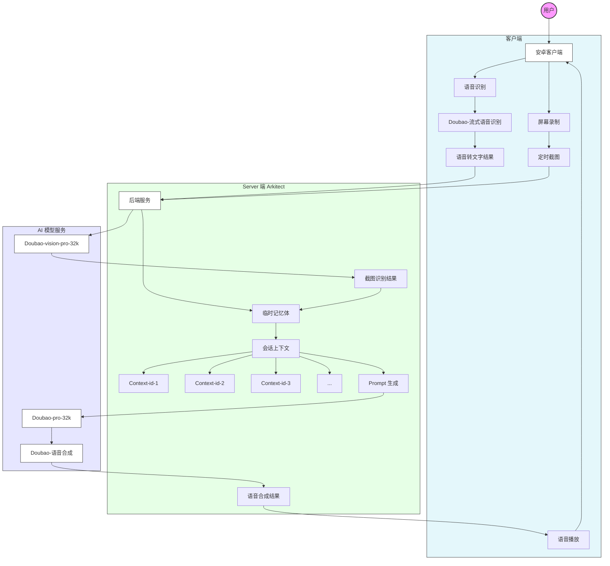

<p align="center">
  
  <br>中文 | <a href="docs/README_en.md">English</a>
  <br>HGDoll 是一款 AI 手机陪玩应用.
</p>

这是一款完全开源的 AI 手机陪玩应用。在你游戏时，HGDoll 可实时看到你的游戏画面，陪你聊天、为你加油鼓劲，带来有趣的陪伴体验。它基于豆包大模型和火山方舟 Arkitect 构建，包含[安卓客户端](android/README.md)（Kotlin）和[后端服务](server/README.md)（Python）两部分，支持本地运行轻松上手。

https://github.com/user-attachments/assets/704d7f2a-3206-45f2-8760-d9cf9577ca7c

目前，HGDoll 还只是一个“小玩具”，仍有许多 Bug 和改进空间，我会持续更新和完善，同时欢迎大家上手体验，一起贡献代码。

## 架构图




## 快速开始

客户端、后端的启动和安装步骤都在对应目录下，需要配置必要的 API Key 申请方法，[点击查看](docs/key.md)

### 项目结构

```
HGDoll/
├── android/          # 安卓客户端
├── server/           # 后端服务
└── docs/             # 项目文档
```

### 技术栈

#### 安卓客户端
- Kotlin
- Jetpack Compose
- Gradle Kotlin DSL
- AndroidX

#### 后端服务
- Python 3.8-3.12
- FastAPI
- 火山方舟 Arkitect SDK
- Uvicorn


## 许可证

本项目采用 MIT 许可证，详见 [LICENSE](LICENSE) 文件。
