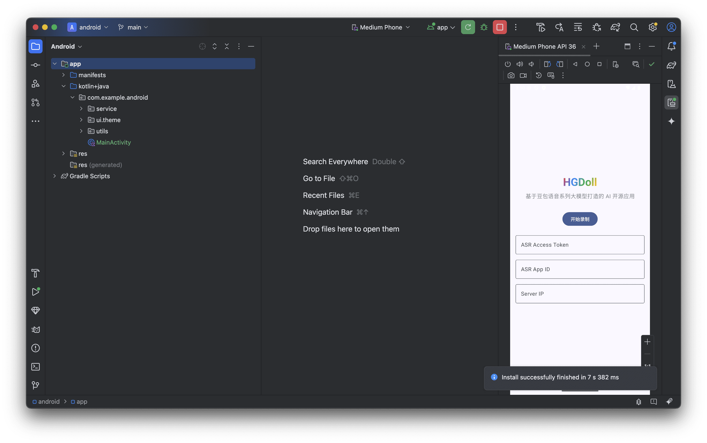

# HGDoll 安卓客户端



HGDoll 是一个基于 Kotlin 和 Jetpack Compose 开发的安卓客户端应用，它采用豆包语音大模型服务，[点击查看](../docs/key.md)如何申请运行所需的 API Key。

## 环境要求

- Android Studio Hedgehog | 2023.1.1 或更高版本
- JDK 17 或更高版本
- Gradle 8.0 或更高版本
- Android SDK 34 (Android 14) 或更高版本

## 快速开始

### 1. 克隆代码库

```bash
git clone https://github.com/521xueweihan/HGDoll.git
cd android/
```

### 2. 配置开发环境

1. 打开 Android Studio
2. 选择 "Open an existing project"
3. 选择克隆下来的 `android` 目录
4. 等待 Gradle 同步完成

### 3. 运行应用

1. 连接 Android 设备或启动模拟器
2. 点击 Android Studio 工具栏中的 "Run" 按钮（绿色三角形）
3. 选择目标设备
4. 等待应用安装和启动
5. 在 App 中输入对应的 ASR Token、ASR App ID、本地 Server IP


## 项目结构

- `app/` - 主应用模块
- `gradle/` - Gradle 包装器文件
- `build.gradle.kts` - 项目级构建配置
- `settings.gradle.kts` - 项目设置文件
- `gradle.properties` - Gradle 属性配置

## 技术栈

- Kotlin - 主要编程语言
- Jetpack Compose - 现代 UI 工具包
- Gradle Kotlin DSL - 构建脚本
- AndroidX - Android 扩展库

## 贡献指南

1. Fork 项目
2. 创建特性分支 (`git checkout -b feature/AmazingFeature`)
3. 提交更改 (`git commit -m 'Add some AmazingFeature'`)
4. 推送到分支 (`git push origin feature/AmazingFeature`)
5. 创建 Pull Request