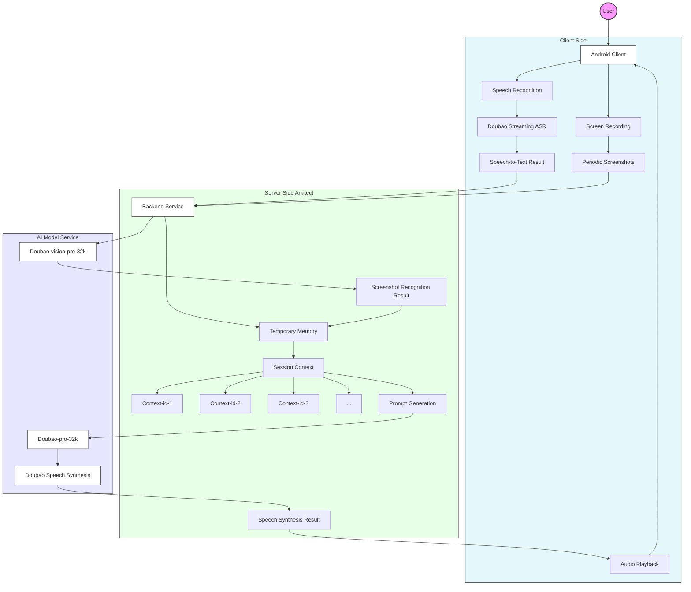

<p align="center">
  
  <br><a href="README.md">中文</a> | English
  <br>HGDoll is an AI mobile companion app.
</p>

This is a fully open-source AI mobile gaming companion app. While you play games, HGDoll can view your game screen in real time, chat with you, and cheer you on, bringing a fun and engaging companion experience. It is built on the Doubao LLM and Volcano Arkitect, consisting of an Android client (Kotlin) and a backend service (Python), both easy to run locally.

Currently, HGDoll is still a "toy" project with many bugs and areas for improvement. We welcome you to try it out and contribute code to help us make it better!

## Architecture Diagram



## Quick Start

Startup and installation instructions for both the client and backend can be found in their respective directories. For API Key configuration, [see here](docs/key.md).

### Project Structure

```
HGDoll/
├── android/          # Android client
├── server/           # Backend service
└── docs/             # Project documentation
```

### Tech Stack

#### Android Client
- Kotlin
- Jetpack Compose
- Gradle Kotlin DSL
- AndroidX

#### Backend Service
- Python 3.8–3.12
- FastAPI
- Volcano Arkitect SDK
- Uvicorn

## License

This project is licensed under the MIT License. See the [LICENSE](LICENSE) file for details.
