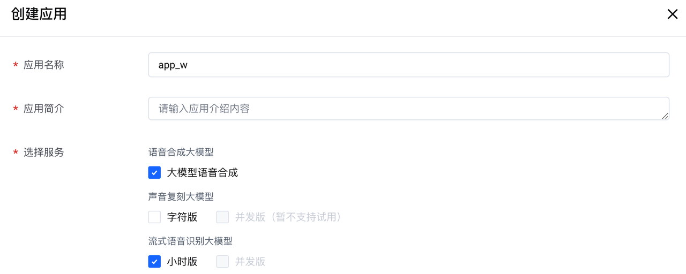
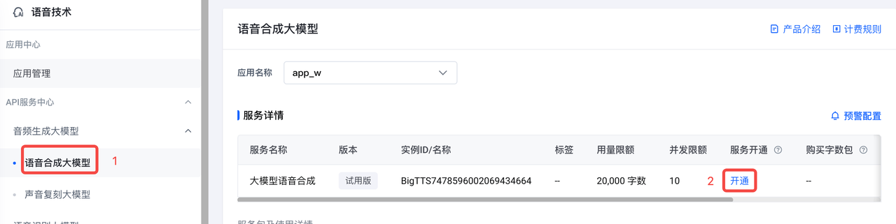
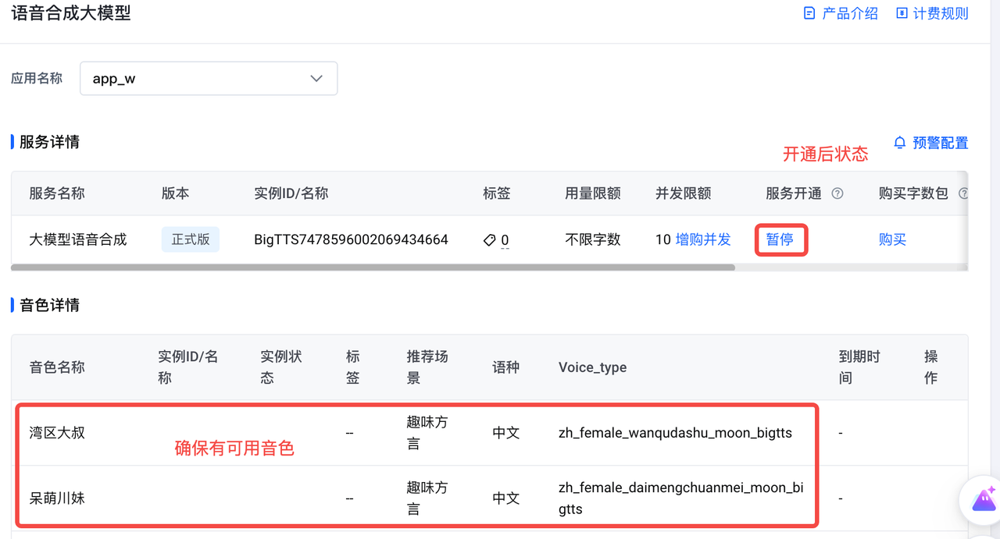
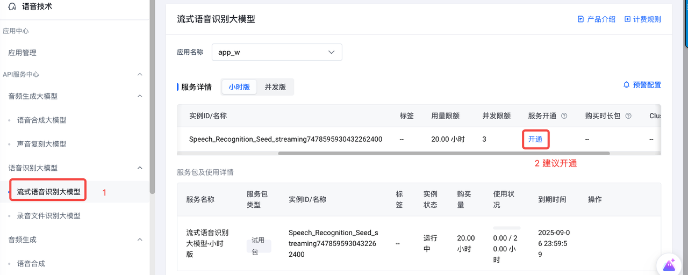
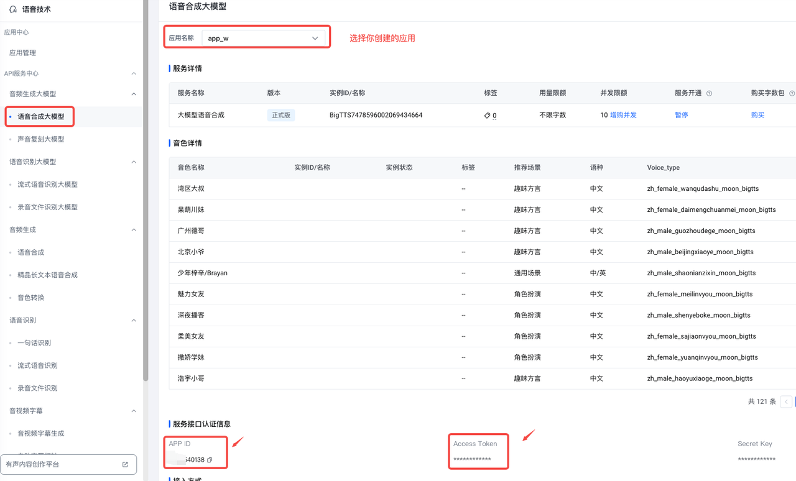
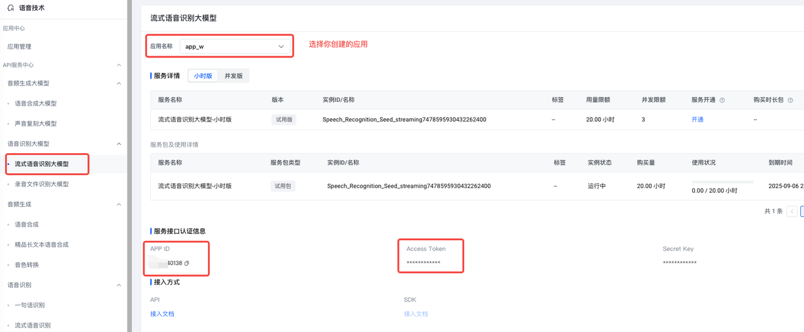

# 如何获取 API Key

### 相关模型

- Doubao-pro-32k：主要参与记忆信息的处理，在当前画面无法直接回答用户问题时，大语言模型将结合历史记忆提供精准答案。
- Doubao-vision-pro-32k：负责对摄像头实时捕捉的视频画面进行视觉内容理解。
- Doubao-语音合成：负责将模型生成的文本回答转化为自然流畅的语音输出。
- Doubao-流式语音识别：将用户的语音提问转写为文本，以便于大模型对用户问题的理解与回复。

## 准备工作

- 已获取火山方舟 API Key [参考文档](https://www.volcengine.com/docs/82379/1298459#api-key-%E7%AD%BE%E5%90%8D%E9%89%B4%E6%9D%83)
- 获取语音技术产品的 APP ID 和 Access Token，获取方式参见【附录】
- 已创建 Doubao-Vision-Pro 32K 的 endpoint  [参考文档](https://www.volcengine.com/docs/82379/1099522#594199f1)
- 已创建 Doubao-Pro 32K 的endpoint [参考文档](https://www.volcengine.com/docs/82379/1099522#594199f1)

## 获取 TTS_APP_ID、TTS_ACCESS_TOKEN、ASR_APP_ID、ASR_ACCESS_TOKEN？

1. [完成企业认证](https://console.volcengine.com/user/authentication/detail/)

2. [开通语音技术产品](https://console.volcengine.com/speech/app)

3. [创建应用](https://console.volcengine.com/speech/app)，同时勾选大模型语音合成和流式语音识别大模型
    

4. 开通语音合成大模型，确保页面具有音色。注意：语音合成大模型从开通到可以使用有大概5-10分钟延迟
   
   

5. 流式语音识别大模型有试用包，可以不开通。如需提供稳定服务，建议开通正式版本。
   

6. 获取TTS_APP_ID 和TTS_ACCESS_TOKEN
   

7. 获取ASR_APP_ID、ASR_ACCESS_TOKEN
   